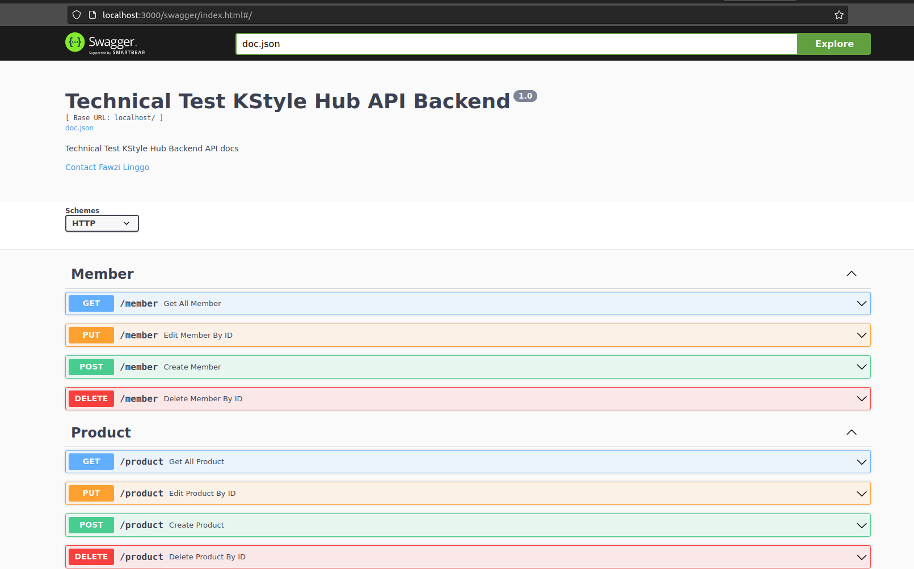

## How to run the project

- Using docker
```bash
docker-compose -f infrastructure.yaml up
```

- Using Go Run
```bash
cd server/http
go run main.go
```

## Task & Endpoint
for Swagger UI, please visit http://localhost:3000/swagger/index.html

image: 

1. Insert data to table Member, endpoint:
```REST
POST http://localhost:3000/member
Content-Type: application/json
{
    "username":"fawzi",
    "gender":"male",
    "skin_type":"oily",
    "skin_color":"white"
}
```

2. Update data to table Member, endpoint:

```REST
PUT http://localhost:3000/member
Content-Type: application/json
{
    "id":"af659e5e-103e-11ee-aac4-0242ac140002",
    "username":"fawzi2",
    "gender":"male3",
    "skin_type":"oily4",
    "skin_color":"white5"
}
```

3. Delete data from table Member, endpoint:

```REST
DELETE http://localhost:3000/member
Content-Type: application/json
{
    "id":"af659e5e-103e-11ee-aac4-0242ac140002"
}
```

4. Get data from table Member, endpoint:

```REST
GET http://localhost:3000/member
Content-Type: application/json
```

5. Get Data Product By ID, endpoint:

```REST
GET http://localhost:3000/product/{id}
Content-Type: application/json
```

6. Insert data to table like_review, endpoint:

```REST
POST http://localhost:3000/like_review
Content-Type: application/json

{
    "product_review_id":"a4c9385d-0fe2-11ee-9db2-0242ac140002",
    "member_id":"88879622-0f7a-11ee-9db2-0242ac140002"
}
```

7. Delete data from table like_review, endpoint:

```REST
DELETE http://localhost:3000/like_review
Content-Type: application/json
{
    "id":"6417d380-101b-11ee-9db2-0242ac140002"
}
```